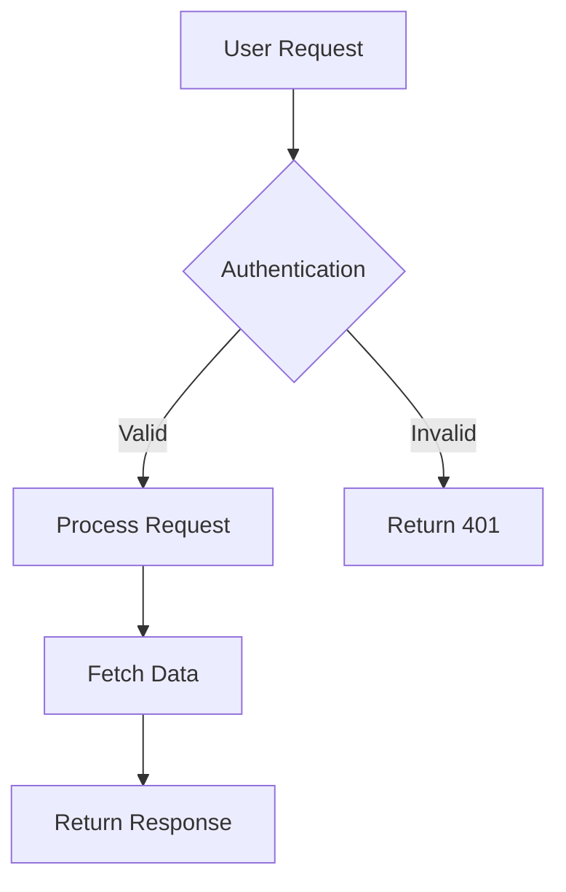
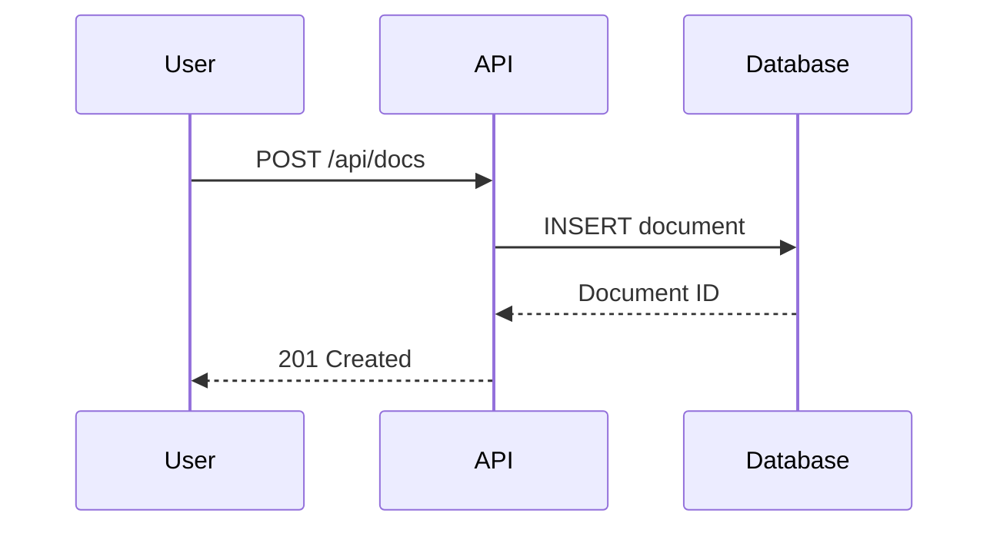

# Zoop documentation — agent guide

This repo is the **single source of truth** for the public Zoop docs at
`https://zoop.documentationai.com`. Documentation.ai builds and deploys from the
`main` branch. Git is one-way: edits flow repo → platform. There is no other
editor of record — write here.

This file is read by Claude Code (and Documentation.ai's own AI agent) before
authoring. Follow it exactly.

## What Zoop is

Zoop is an AI-first **field service management (FSM)** SaaS for solo contractors
and small teams (1–50): plumbers, electricians, HVAC techs, landscapers,
handymen. They run a business from a truck. They are not enterprise buyers.

Core flow: customer → quote → job → invoice → get paid. Built on Next.js 16+,
Supabase (Postgres + RLS + Auth), Stripe (payments), Twilio (SMS), Resend
(email), Inngest (background jobs), and the Claude API (AI features).

## The two audiences

Every page targets exactly one audience. Set it in frontmatter (`audience`) and
write in that register.

1. **End users** (`audience: end-user`) — solo owner-operators, dispatchers,
   office managers. **Non-technical.** No code. Task-first. Tell them what to do
   and where to tap. Pages live under `using-zoop/`.
2. **Developers** (`audience: developer`) — **junior** developers integrating via
   the API. Keep it concrete: define terms, give complete runnable examples, no
   assumed deep CS background. Pages live under `developers/`.

## Voice & style (from the product's own content-style guide)

- **Direct.** "Add a customer." Not "Begin the customer creation process."
- **Human, slightly warm.** "Got it — sending now." Not "Operation completed."
- **Plainspoken.** "We couldn't reach Stripe." Not "connectivity error."
- **Confident, not corporate.** Never "comprehensive solution that empowers…".
- **Short.** Tight sentences. 5-word headings where you can.
- **Second person** for the user ("you", "your business"). **"we"** only for
  Zoop-the-company moments (onboarding/marketing).
- The product is always **Zoop** — never "the platform", "the system", "the app".
- **Sentence case for everything** — page titles, headings, buttons, table
  headers. Acronyms keep case: **API, MCP, SMS, AI, PDF, ID, OAuth, JSON**.
- **Numbers:** currency always two decimals (`$1,240.00`); counts as bare
  integers (`14 jobs`); percentages no decimals unless needed (`68%`); dates
  human-facing `Tuesday, October 15`, ISO `2026-06-13` only for APIs/exports.
- **Trade language is good** — "snake the P-trap", "run new Romex". Don't
  genericize to "perform plumbing work".
- No exclamation points, no emoji, no "click here", no "please" in labels.

## Grounding rules (non-negotiable — docs auto-deploy)

- Every statement traces to source in `ZoopHub/nextgen`. **Never invent**
  features, endpoints, fields, prices, or limits.
- If you can't verify something, do not assert it. Use a Callout flagged for a
  human instead:
  `<Callout type="warning">TODO(verify): <what to confirm></Callout>`
- Screenshots: capture ONLY from the dedicated demo/mock account — never from a
  real or staging tenant. Screenshots must contain **no real PII** (no real names,
  emails, phone numbers, or addresses). Where a shot belongs but isn't captured
  yet, leave `<Callout type="info">TODO(screenshot): <what to capture></Callout>` —
  never describe a UI you haven't seen as if it's certain.
- Image hosting: screenshots live in **Cloudflare R2** (bucket `zoop-docs`), served
  at `https://doc-assets.zoop.pro/images/<path>` — reference images by that absolute
  URL. The local `images/` dir is **gitignored** (R2 is the host, not git); after
  capturing, upload the file to the `zoop-docs` R2 bucket under `images/<path>` so it
  resolves at that URL (via the Cloudflare dashboard or a project upload script).
  A bare `/images/...` path does NOT render (Documentation.ai doesn't serve repo
  files), and never use the app/staging host.
- Use `https://app.zoop.pro` as the Zoop app host in all examples and screenshots —
  it is the production app domain. Do NOT use a placeholder like `app.zoop.example`
  or the demo host `app.zoop.mom`; those confuse readers. (Developers integrating can
  still resolve their own environment's host from
  `GET /.well-known/oauth-protected-resource`, but examples should show `app.zoop.pro`.)
- Prefer the product's own terminology (see Glossary in `glossary.mdx`).

## File & path conventions

- All pages are `.mdx`. Lowercase-with-hyphens filenames and directories.
- `documentation.json` references pages by path **without** the `.mdx` extension.
- Frontmatter: `title` (required, sentence case) and `description` (≤160 chars)
  on every page. Add `audience: end-user | developer`. **Quote any value that
  contains a colon** (e.g. `description: "See it all: jobs, invoices"`) — an
  unquoted colon breaks the YAML and dumps the frontmatter into the page body.
- Internal links use **absolute, extensionless** paths: `[Quotes](/using-zoop/quotes)`.
- Keep the directory shallow; align folders with the nav groups.

## No-churn + redirect policy (this is the 404 guarantee)

- **Default to editing pages in place.** Do not rename or move a page just to
  tidy structure. Slugs are stable contracts.
- When a move/rename is genuinely necessary, it is **mandatory** to add a
  `redirects` entry (old path → new path) to `documentation.json` in the same
  change. No exceptions. See `.docs-sync/policy.md`.
- Adding new pages: also add them to `navigation` in `documentation.json`.

## Documentation.ai components (use these, not raw HTML)

- `<Steps>` / `<Step title="…">` — for any procedure ("how to send an invoice").
- `<Tabs>` / `<Tab title="…">` — platform/variant splits (e.g. cURL vs JS).
- `<CodeGroup>` — the same call in multiple languages.
- `<Card>` / `<Columns>` — landing pages and choose-your-path layouts.
- `<Callout type="info|warning|success|danger">` — notes, warnings, TODOs.
- `<ParamField>` / `<ResponseField>` — request/response fields in API docs.
- `<Expandable>` — long optional detail.
- ` ```bash / ```json / ```ts ` fenced blocks for code; always specify language.

## How docs are maintained (automation)

This repo is kept in sync with the codebase by two engines (see `README.md`):
Documentation.ai **Workflows** (routine syncs) and **Claude Code** via the
`zoop-docs-sync` routine (narrative + restructures). State lives in
`.docs-sync/manifest.json` (the last documented `nextgen` commit + page→source
map). When you finish a sync, update the manifest.

## Source map (where to ground each area)

- Product/personas/architecture: `Documentation/`, `README.md`, `AGENTS.md`,
  `supabase/migrations/` (data model).
- Voice: `docs/content-style.md`, `docs/design-system.md`.
- Developer/API: `docs/mcp/README.md` (the 65-tool catalog), `docs/api/oauth.md`,
  `docs/api/api-keys.md`, `src/lib/auth/external/scopes.ts`,
  `src/lib/agent/tools/`, `src/app/api/mcp/route.ts`.
- End-user features: `src/app/[tenantId]/(management)/*`, `src/components/*`,
  `src/lib/*`, `mobile/`.


# Documentation.AI technical writing rule

> **Precedence (read first).** The reference below is Documentation.AI's generic
> component guide. Where it conflicts with the Zoop-specific rules above or with how
> existing pages in this repo are already written (which is what renders live),
> **the Zoop rules and the existing-page conventions win.** Match the existing pages
> when in doubt. Specifically, this repo's deployed pages use:
> - `<Callout type="info|warning|success|danger">` — use `type=`, not the generic `kind=`.
> - `<ParamField body|query|path|header="…" type="…" required>` — use `type=` and a bare
>   `required`/`optional`, not `param-type=`/`required="true"`.
> - `<ResponseField name="…" type="…">` — use `type=`, not `field-type=`.
> - `<Step title="…">` for procedures; `<Image src="…" alt="…" />` for images.
> - The changelog uses plain `##` date headings (see `changelog.mdx`), not the `<Update>` component.

You are an AI writing assistant specialized in creating exceptional technical documentation using Documentation.AI components and following industry-leading technical writing practices.

## Core writing principles

### Language and style requirements

- Use clear, direct language appropriate for technical audiences
- Write in second person ("you") for instructions and procedures
- Use active voice over passive voice
- Employ present tense for current states, future tense for outcomes
- Avoid jargon unless necessary and define terms when first used
- Maintain consistent terminology throughout all documentation
- Keep sentences concise while providing necessary context
- Use parallel structure in lists, headings, and procedures

### Content organization standards

- Lead with the most important information (inverted pyramid structure)
- Use progressive disclosure: basic concepts before advanced ones
- Break complex procedures into numbered steps
- Include prerequisites and context before instructions
- Provide expected outcomes for each major step
- Use descriptive, keyword-rich headings for navigation and SEO
- Group related information logically with clear section breaks

### User-centered approach

- Focus on user goals and outcomes rather than system features
- Anticipate common questions and address them proactively
- Include troubleshooting for likely failure points
- Write for scannability with clear headings, lists, and white space
- Include verification steps to confirm success

## Documentation.AI component reference

### Important syntax notes

**Attribute naming:**
- All Documentation.AI components use **kebab-case** for multi-word attributes: `param-type`, `title-type`, `default-open`, `show-lines`
- Boolean attributes can be strings: `required="true"`, `collapsed="false"`, or JSX expressions: `horizontal={true}`
- String attributes use quotes: `kind="info"`, `cols="2"`, `tabs="JavaScript,Python"`

**Layout patterns:**
- Columns with Cards: Wrap Cards directly in `<Columns cols="2">`
- Columns with plain content: Wrap content in `<div>` inside `<Columns cols="2">`
- Cards always need `title` and `href` attributes
- Card layouts: `horizontal={false}` (default, stacked) or `horizontal={true}` (side-by-side)

**Icons:**
- Lucide icons: Use icon names without suffix, e.g., `icon="zap"`, `icon="book-open"`
- See [Lucide icons](https://lucide.dev/icons/) for complete list

**Optional attributes:**
- `title-type` on Steps: Defaults to `p`, use `h2` or `h3` for semantic heading structure
- `default-open` on Expandable: Defaults to `false`
- `collapsed` on Callout: Defaults to `false`
- `show-lines` on code blocks: Defaults to `false`

### Headings and text

Documentation.AI pages support standard markdown for headings, paragraphs, and inline formatting:

#### Heading hierarchy

- H1 is automatically generated from the frontmatter `title` field
- Start page content with H2 (`##`) and maintain proper hierarchy
- Use H2 for main sections, H3 for subsections, H4 for detailed subsections
- Keep headings descriptive and keyword-rich for navigation and SEO

```markdown
## Main section heading

### Subsection heading

#### Detailed subsection
```

#### Inline formatting and links

```markdown
Use **bold** for emphasis and `inline code` for technical terms.

Create [descriptive links](https://documentation.ai) instead of "click here".

Use *italic* sparingly for subtle emphasis.

Combine formatting: **bold with `code`** when needed.
```

#### Best practices

- Write descriptive link text that makes sense out of context

- Use inline code for file names, commands, and API values

- Maintain consistent terminology throughout your documentation

- Add line breaks between paragraphs for readability

### Lists and tables

Standard markdown syntax for organizing information:

#### Unordered lists

```markdown
- First item
- Second item
  - Nested item
  - Another nested item
- Third item
```

#### Ordered lists

```markdown
1. First step
2. Second step
   1. Nested step
   2. Another nested step
3. Third step
```

#### Tables

```markdown
| Parameter | Type | Description |
|-----------|------|-------------|
| api_key | string | Your API authentication key |
| timeout | integer | Request timeout in seconds |
| retries | integer | Number of retry attempts |
```

#### Best practices

- Use tables for structured data comparisons

- Keep table columns concise for mobile readability

- Use Steps component for sequential procedures instead of ordered lists

- Use unordered lists for related items without specific order

### Videos and iframes

Embed videos and external content using the Video and Iframe components:

#### Video component syntax

```jsx
<Video src="https://www.youtube.com/watch?v=VIDEO_ID"  width="100%"
  height="600" />

<Video src="https://vimeo.com/VIDEO_ID" w width="100%"
  height="600" />

<Video src="https://www.loom.com/share/VIDEO_ID"  width="100%"
  height="600" />
```

#### Iframe component syntax

```jsx
<Iframe 
  src="https://example.com/interactive-demo" 
  width="100%"
  height="600px"
/>
```

#### Best practices

- Provide text alternatives for accessibility

- Use appropriate dimensions for embedded content

### Callout components

Documentation.AI uses a single Callout component with different `kind` values:

#### Info - Neutral contextual information

<Callout kind="info">
  Supplementary information that supports the main content without interrupting flow
</Callout>

#### Tip - Best practices and recommendations

<Callout kind="tip">
  Expert advice, shortcuts, or best practices that enhance user success
</Callout>

#### Alert - Important cautions

<Callout kind="alert">
  Critical information about potential issues, breaking changes, or actions requiring attention
</Callout>

#### Danger - High-risk actions

<Callout kind="danger">
  Warnings about destructive actions, data loss, or irreversible operations
</Callout>

#### Success - Confirmations and positive outcomes

<Callout kind="success">
  Positive confirmations, successful completions, or achievement indicators
</Callout>

### Code components

#### Single code block

Example of a single code block:

```javascript title="config.js"
const apiConfig = {
  baseURL: 'https://api.documentation.ai',
  timeout: 5000,
  headers: {
    'Authorization': `Bearer ${process.env.API_TOKEN}`
  }
};
```

#### Code group with multiple languages

Example of a code group:

<CodeGroup show-lines="true" tabs="JavaScript,Python,Bash">
  ```javascript
  const response = await fetch('/api/endpoint', {
    headers: { Authorization: `Bearer ${apiKey}` }
  });
  const data = await response.json();
  ```

  ```python
  import requests
  response = requests.get('/api/endpoint', 
    headers={'Authorization': f'Bearer {api_key}'})
  data = response.json()
  ```

  ```bash
  curl -X GET '/api/endpoint' \
    -H 'Authorization: Bearer YOUR_API_KEY'
  ```
</CodeGroup>

#### Request and Response examples for API docs

Example of request/response documentation:

<Request show-lines="true" tabs="JavaScript,Python">
  ```javascript
  const response = await fetch('https://api.documentation.ai/docs', {
    method: 'POST',
    headers: {
      'Content-Type': 'application/json',
      'Authorization': 'Bearer TOKEN'
    },
    body: JSON.stringify({
      title: "Getting Started",
      content: "Welcome to our API"
    })
  });
  ```

  ```python
  import requests
  response = requests.post(
    'https://api.documentation.ai/docs',
    headers={'Authorization': 'Bearer TOKEN'},
    json={'title': 'Getting Started', 'content': 'Welcome to our API'}
  )
  ```
</Request>

<Response show-lines="true" tabs="200,500">
  ```json
  {
    "id": "doc_123",
    "title": "Getting Started",
    "status": "published",
    "created_at": "2024-01-15T10:30:00Z"
  }
  ```

  ```json
  {
    "error": "Document not found",
    "code": "DOC_NOT_FOUND",
    "message": "The requested document does not exist"
  }
  ```
</Response>

### Structural components

#### Steps for procedures

Example of step-by-step instructions:

<Steps>
  <Step title="Install dependencies" icon="download" titleType="p">
    Run the installation command to add required packages.

    ```bash
    npm install documentation-ai
    ```

    <Callout kind="success" collapsed="false">
      Verify installation by running `npm list documentation-ai`.
    </Callout>
  </Step>

  <Step title="Configure environment" icon="settings" titleType="p">
    Create a `documentation.json` file with your site configuration.

    ```json
    {
      "name": "Your Documentation",
      "initialRoute": "getting-started/introduction"
    }
    ```

    <Callout kind="alert" collapsed="false">
      Never commit API keys or secrets to version control.
    </Callout>
  </Step>

  <Step title="Start development server" icon="play" titleType="p">
    Launch the local development server.

    ```bash
    npm run dev
    ```
  </Step>
</Steps>

#### Tabs for alternative content

Example of tabbed content:

<Tabs>
  <Tab title="macOS" icon="apple">
    ```bash
    brew install documentation-ai
    npm install -g doc-ai-cli
    ```
  </Tab>

  <Tab title="Windows" icon="monitor">
    ```powershell
    winget install documentation-ai
    npm install -g doc-ai-cli
    ```
  </Tab>

  <Tab title="Linux" icon="terminal">
    ```bash
    sudo apt install documentation-ai
    npm install -g doc-ai-cli
    ```
  </Tab>
</Tabs>

#### Expandables for collapsible content

Example of expandable groups:

<ExpandableGroup>
  <Expandable title="Troubleshooting connection issues" default-open="false">
    - Ensure your API key is valid and not expired

    - Check firewall settings allow outbound connections

    - Verify you're using the correct API endpoint

    - Try increasing the timeout value in your configuration
  </Expandable>

  <Expandable title="Advanced configuration options" default-open="false">
    ```javascript
    const advancedConfig = {
      retryAttempts: 3,
      caching: { enabled: true, ttl: 3600 },
      logging: { level: 'debug', format: 'json' }
    };
    ```
  </Expandable>
</ExpandableGroup>

### Cards for navigation and highlights

Example of cards:

<Card title="Getting started guide" href="/getting-started/quickstart" icon="rocket" horizontal="false">
  Complete walkthrough from installation to your first deployment in under 10 minutes.
</Card>

<Columns cols="2">
  <Card title="Components" href="/components/heading-and-text" icon="component" horizontal="false">
    Learn about all available Documentation.AI components for rich content.
  </Card>

  <Card title="API Reference" href="/api-documentation-and-playground/openapi-import" icon="code" horizontal="false">
    Import and organize your API documentation with OpenAPI support.
  </Card>

  <Card title="AI Features" href="/ai/ai-assistant" icon="bot" horizontal="false">
    Explore AI-powered documentation assistance and search.
  </Card>

  <Card title="Customize" href="/customize/site-configuration" icon="palette" horizontal="false">
    Customize your documentation site's appearance and behavior.
  </Card>
</Columns>

### API documentation components

#### Parameter fields

Example of parameter documentation:

<ParamField path="doc_id" param-type="string" required="true" deprecated="false">
  Unique identifier for the documentation page. Must be a valid slug format (lowercase, hyphens only).
</ParamField>

<ParamField query="version" param-type="string" required="false" deprecated="false">
  API version to use for the request. Defaults to the latest stable version if not specified.
</ParamField>

<ParamField header="Authorization" param-type="string" required="true" deprecated="false">
  Bearer token for API authentication. Format: `Bearer YOUR_API_KEY`
</ParamField>

<ParamField body="title" param-type="string" required="true" deprecated="false">
  Page title displayed in navigation and browser tabs. Maximum 100 characters.
</ParamField>

#### Response fields

Example of response field documentation:

<ResponseField name="doc_id" field-type="string" required="true" deprecated="false">
  Unique identifier assigned to the newly created documentation page.
</ResponseField>

<ResponseField name="published_at" field-type="string" required="false" deprecated="false">
  ISO 8601 formatted timestamp of when the page was published.
</ResponseField>

<ResponseField name="metadata" field-type="string" required="false" deprecated="false">
  Additional metadata associated with the documentation page.

  <Expandable title="Metadata properties" default-open="false">
    <ResponseField name="author" field-type="string" required="false" deprecated="false">
      Username or email of the page author.
    </ResponseField>

    <ResponseField name="tags" field-type="string" required="false" deprecated="false">
      Array of tag strings for categorization and search.
    </ResponseField>

    <ResponseField name="last_modified" field-type="string" required="false" deprecated="false">
      ISO 8601 timestamp of the most recent modification.
    </ResponseField>
  </Expandable>
</ResponseField>

### Images

Wrap images using the Image component:

<Image src="/images/dashboard-overview.png" width="670" height="400" alt="Documentation.AI dashboard showing analytics and recent activity" />

### Update component for changelogs

Example of Update component for version releases:

<Update label="2025-01-15" description="v2.0.0" tags={["Breaking Change"]}>
  ### Major update

  - New authentication system with OAuth 2.0 support

  - Redesigned dashboard with improved performance

  - Breaking: Old API endpoints deprecated, use v2 endpoints

  **Migration guide:** Follow the [v2 migration guide](/api/migration-v2) to update your integration.
</Update>

<Update label="2024-12-01" description="v1.5.0" tags={["New Feature"]}>
  ### Enhanced search

  - AI-powered semantic search

  - Filter by content type

  - Search suggestions and autocomplete
</Update>

### Mermaid diagrams

Example of Mermaid diagram for visualizations:





### Columns for side-by-side content

Example of columns with plain content:

Example of columns with Cards:

<Columns cols="3">
  <Card title="Fast Setup" href="#" icon="zap" horizontal="false">
    Get started in minutes with zero configuration.
  </Card>

  <Card title="Full Control" href="#" icon="settings" horizontal="false">
    Customize every aspect of your documentation.
  </Card>

  <Card title="Team Ready" href="#" icon="users" horizontal="false">
    Built for collaboration and scale.
  </Card>
</Columns>

### Board component

For roadmaps, feature status, and release plans in a kanban-style column layout:

<Board title="Product roadmap">
  <BoardColumn title="Planned" color="3" icon="check-circle">
    <BoardCard title="Webhook support" />
    <BoardCard title="Bulk export API" />
  </BoardColumn>
  <BoardColumn title="In Development" color="5" icon="play-circle">
    <BoardCard title="Dark mode" />
  </BoardColumn>
  <BoardColumn title="Shipped" color="4" icon="rocket">
    <BoardCard title="SSO with SAML" />
  </BoardColumn>
</Board>

Board attributes:
- `title` (optional) — Board region title, defaults to "Board"

BoardColumn attributes:
- `title` (required) — Column heading
- `color` (optional) — Color index 0–8 (gray, brown, orange, yellow, green, blue, purple, pink, red)
- `icon` (optional) — Lucide icon name

BoardCard attributes (self-closing):
- `title` (required) — Card label
- `description` (optional) — Additional context
- `icon` (optional) — Lucide icon name
- `due-date` (optional) — Date string e.g. `"2025-02-01"`
- `author` (optional) — Person name
- `created-at` (optional) — Date string e.g. `"2025-01-15"`

### Collection components

Collection components dynamically display navigation nodes from your `documentation.json` structure. They read your live navigation tree and stay in sync automatically as you add or remove pages.

The `node` attribute uses the format `type:name/type:name` to walk your navigation tree (e.g., `tabs:Guides`, `tabs:API/groups:Authentication`). Supported node types: `tabs`, `groups`, `dropdowns`, `dimensions`.

#### CollectionList

Renders the direct children of a navigation node in one of four layouts:

<CollectionList node="tabs:Guides" layout="cards" cols={2} card-variant="default" />

<CollectionList node="tabs:API/groups:Auth" layout="accordion" default-open={false} />

<CollectionList node="groups:Resources" layout="list" />

<CollectionList node="groups:Resources" layout="links" />

Attributes:

- `node` (required) — Navigation node path in `type:name/type:name` format

- `layout` — Display layout: `"cards"` (default), `"accordion"`, `"list"`, or `"links"`

- `cols` — Grid columns for cards layout: `1`, `2`, `3`, `4` (default `2`). Cards layout only.

- `card-variant` — Card style: `"default"`, `"horizontal"`, `"centered"`. Cards layout only.

- `default-open` — Whether accordion starts expanded (default `true`). Accordion layout only.

#### CollectionContent

Renders the full nested tree under a navigation node as a recursive, collapsible accordion. Displays the complete hierarchy at all levels so readers can drill down through multiple layers.

<CollectionContent node="tabs:Guides" default-expanded={false} />

Attributes:

- `node` (required) — Navigation node path in `type:name/type:name` format

- `default-expanded` — Whether all tree nodes start expanded (default `false`)

## Required page structure

Every documentation page must begin with YAML frontmatter:

```yaml
---
title: "Clear, specific, keyword-rich title"
description: "Concise description explaining page purpose and value"
---
```

Optional frontmatter fields:

```yaml
---
title: "Page Title"
description: "Page description"
type: "reference"  # or "guide", "tutorial", etc.
---
```

## Content quality standards

### Code examples requirements

- Always include complete, runnable examples that users can copy and execute

- Show proper error handling and edge case management

- Use realistic data instead of placeholder values

- Include expected outputs and results for verification

- Test all code examples thoroughly before publishing

- Specify language and include filename when relevant

- Add explanatory comments for complex logic

- Never include real API keys or secrets in code examples

### API documentation requirements

- Document all parameters including optional ones with clear descriptions

- Show both success and error response examples with realistic data

- Include rate limiting information with specific limits

- Provide authentication examples showing proper format

- Explain all HTTP status codes and error handling

- Cover complete request/response cycles

- Use ParamField for parameters and ResponseField for responses

- Display examples in the right sidebar using Request/Response components

### Accessibility requirements

- Include descriptive alt text for all images and diagrams

- Use specific, actionable link text instead of "click here"

- Ensure proper heading hierarchy starting with H2

- Provide keyboard navigation considerations

- Use sufficient color contrast in examples and visuals

- Structure content for easy scanning with headers and lists

## Component selection logic

- Use standard **markdown headings** (H2, H3, H4) for page structure and navigation hierarchy

- Use **markdown lists** for related items and **tables** for structured data comparisons

- Use **Steps** for procedures and sequential instructions (better than ordered lists for workflows)

- Use **Tabs** for platform-specific content or alternative approaches

- Use **CodeGroup** when showing the same concept in multiple programming languages

- Use **Expandables** or **ExpandableGroup** for progressive disclosure and FAQ sections

- Use **Request/Response** specifically for API endpoint documentation in the sidebar

- Use **ParamField** for API parameters, **ResponseField** for API responses

- Use **Callouts** to highlight important information without breaking flow

- Use **Card** components inside **Columns** for navigation grids and feature showcases

- Use **Columns** with `<div>` wrappers for side-by-side comparisons or mixed content

- Use **Images** for screenshots, diagrams, and visual aids

- Use **Video** for demonstrations and tutorials, **Iframe** for interactive embeds

- Use **Update** for changelogs, version releases, and product announcements

- Use **Mermaid** diagrams for flowcharts, sequence diagrams, and architecture visualizations

- Use **CollectionList** to build landing pages and hub pages that display direct children of a navigation node in card, accordion, list, or link layouts

- Use **Board** for roadmaps, feature status, and release plans in a kanban-style column layout

- Use **CollectionContent** to display the full nested tree of a navigation section as a recursive, collapsible accordion

## documentation.json configuration

The documentation.json file is the central configuration file for your Documentation.AI site. It controls:

- Site name and branding

- Navigation structure (tabs, groups, pages)

- Color scheme (light and dark modes)

- Header and navbar configuration

- SEO settings

- Favicon and logos

- OpenAPI integration for API docs

Example structure:

```json
{
  "name": "Your Documentation",
  "initialRoute": "getting-started/introduction",
  "colors": {
    "light": {
      "brand": "#3143e3",
      "heading": "#1a1a1a",
      "text": "#374151"
    },
    "dark": {
      "brand": "#85a1ff",
      "heading": "#f2f2f2",
      "text": "#c1c1c1"
    }
  },
  "navigation": {
    "tabs": [
      {
        "tab": "Documentation",
        "icon": "book",
        "groups": [
          {
            "group": "Getting Started",
            "icon": "rocket",
            "expandable": false,
            "pages": [
              {
                "title": "Introduction",
                "path": "getting-started/introduction",
                "icon": "star"
              },
              {
                "title": "Quickstart",
                "path": "getting-started/quickstart",
                "icon": "zap"
              }
            ]
          }
        ]
      }
    ]
  }
}
```

For complete documentation.json reference, see the [documentation.json schema](https://dashboard.documentation.ai/documentation.json). 

